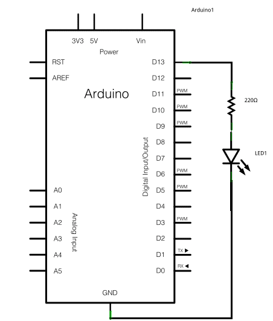
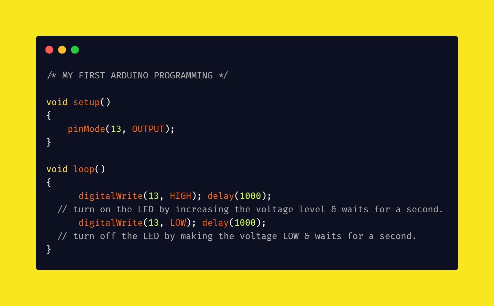

**ARDUINO SERIES 001**

---

> :Name: [Your Name]
> :Email: [user@yourmail.com]
> :Date: 27/02/2021
> :Revision: version#
> :License: Public Domain

---

**Project**: Blink using Arduino uno.

Step 1: **Installation**

- This tutorial shows the simplest thing you can do with an arduino board. It is also known as the "**Hello world!**" of microcontrollers.

**Components required**:

> **Hardware**:
>
>> - Arduino board.
>>   - You can use only the Arduino Board for this example if you want.
>> - LED
>> - 110 ohm resistor (optional)
>>   - You can use the resistor to prevent overflow of current.
>>
>
> **Software**:
>
>> - [Arduino Nightly](https://www.arduino.cc/en/Main/Software) Or [Platformio on vscode](https://platformio.org/platformio-ide)
>>
>
> ---

Step 2: **Assembling the circuit**

- Assemble the circuit following the diagram **layout-1** attached to the sketch below. Connect the Cathode(-) to the ground pin(gnd) and the Anode(+) to the resistor to pin 13.
  - below is an image from [tinkercad](https://www.tinkercad.com/things/liwSyHrCJiv) on how the circuit is assembled. 
  - **Schematic**:
    - 

Step 3: **Load the code**

- After you build the circuit connect your Arduino board to your computer, start the Arduino Software (IDE) and write the code below. You may also load it from the menu; /File/Examples/01.Basics/Blink . The first thing you do is to initialize LED_BUILTIN pin as an output pin with the line

> 
>
> **Code Description**:
>
>> The blink code turns an LED on for one second, then off for one second, repeatedly.
>>
>> - The `setup()` function is called when a sketch starts. It is used to initialize variables, pin modes, libraries, etc. It only run's once after each powerup or reset of the Arduino board.
>>   - The pinMode in the `setup()` function is used to set the digital pin `13`as an output... pinMode ==>`pinMode(pin, mode)`; pin =13, mode = output...
>> - The `loop()` function does exactly as the name suggests, and it loops without interruption, allowing your program to change and respond as it runs. The code in the `loop()` section of your sketch is used to actively control the board.
>>   - The `digitalWrite(pin, value)` in the `loop()` function will enable `(HIGH)` or disable `(LOW)` the `LED`
>>     - If the `pinMode()` isn't set to `OUTPUT` the led may appear dim when calling the `digitalWrite()`
>>   - the `delay()` keeps the LED on/off for the time specified in miliseconds(ms).
>> - The `// or /**/` is used to comment on a code and the IDE doesn't read it as part of the code.
>>
>
> .

**Folder structure**:
ARDUINO SERIES  => 001-sketch_feb27a_blink = [{file number + date + project title}]

├── sketch123.ino             => main Arduino file.

├── schematics.png          => (optional) an image of the required schematics.

├── arduino-blink.png      => an image containing the code.

├── arduino-sketch.png    => an image containing the assembled circuit.

└── ReadMe.md      =>   this file.

**License**:

- This project is released under a [**Public Domain**] License.

> Note:
>
>> This document is written in the Marddown document format, a markup language to describe documents.
>> If you need help you can check the Pdf file i this folder or visit MarkDown Cheatsheet [Md-Cheatsheet](https://www.markdownguide.org/basic-syntax/)
>>
>
> .
